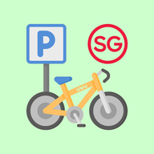

<div align="center">



# SG Bike Parking Finder

**Find bicycle parking near you in Singapore.**

A web app and a Telegram bot over the same data, sharing one set of favourites.

</div>

---

## What this is

Singapore has thousands of public bicycle racks, and LTA publishes where all of
them are. What it does not publish is a way to find the one nearest to you, on a
phone, in the rain, in ten seconds.

That is what this is. Point it at where you are or where you are going, and it
tells you what racks are close, how many lots they have, and whether they are
sheltered.

Two ways in, both over the same data.

| | |
| --- | --- |
| **[Web app](main-site/)** | Installable PWA. Map and list views, distance and shelter filters, works offline on cached results. |
| **[Telegram bot](telegram-bot/)** | Search by sending a message or sharing your location. Saved spots sync with the web app. |

This is a directory of where racks are. It is not live occupancy, and nothing
here can tell you whether a rack is currently full.

---

## Repository layout

```
.
├── main-site/          The web app, deployed on Vercel
│   ├── api/            Serverless functions
│   │   ├── bicycle-parking.js   LTA proxy, keeps the API key server side
│   │   ├── device.js            Registers a browser session
│   │   ├── favourites.js        Favourites for a session or a linked account
│   │   ├── link.js              Mints and revokes Telegram links
│   │   └── backup-codes.js      Approval gated recovery codes
│   ├── js/             Front end modules
│   ├── migrations/     Supabase SQL, run in order
│   └── index.html
│
└── telegram-bot/       Telethon bot, runs on a VPS in tmux
    ├── handlers/       Commands, messages and button callbacks
    ├── README.md       What it does and how to run it
    └── SETUP.md        BotFather and first time setup
```

---

## Features

### Web app

- Locates you on load, with address and postal code search as a fallback
- Map view on Leaflet with a radius circle, or a list sorted by distance,
  capacity or shelter
- Radius of 0.5, 1, 1.5 or 2 kilometres
- Filters for sheltered only, racks, and yellow boxes
- Navigation handoff to Google Maps, Waze, Apple Maps or OpenStreetMap cycle
  routing, plus an in page map
- **Favourites**, saved with a star in the corner of any result
- Seven colour themes, light and dark
- Installable PWA that keeps working offline on the last results it fetched
- The LTA key never reaches the browser, because a serverless function holds it

### Telegram bot

- Send an address, a postal code or a place name to search, or share your
  location
- A star on every result saves it, and the same star removes it
- `/fav` lists everything saved, `/settings` sets radius and filters
- Inline buttons that keep working after a restart, because their payloads live
  in SQLite rather than in memory
- Two factor backup codes for getting your favourites back if Telegram is out
  of reach

---

## Favourites sync

Star a spot on your phone, open your laptop, and it is there. Star one in chat
and it is on the site.

What makes this unusual is what it does **not** involve. There is no account, no
password, no email, no sign up, and no auth of any kind. Linking exists for one
purpose, which is syncing favourites, and it creates nothing you would have to
manage afterwards.

**How it works.** A browser identifies itself with a device id and a secret it
generates and keeps in its own `localStorage`. The web app mints a single use
token and sends you to `t.me/sgbikepark_bot?start=<token>`. The bot redeems the
token, and one database transaction creates the link and merges both favourite
sets, dropping duplicates by parking code.

**Favourites work before any of that.** Stars save locally and immediately, with
no network and no link. The server copy is a sync layer over the local one, not
a prerequisite for it.

**One account, many browsers.** A Telegram account can own any number of linked
browsers, so a phone, a laptop and a desktop all show the same list. Each needs
its own link.

**Unlinking loses nothing.** Every browser keeps a copy of the list as it stood,
the chat keeps its copy, and the two simply stop syncing.

### Backup codes

If Telegram is unreachable, a lost phone or a locked account, backup codes get
your favourites onto a fresh browser without it.

Generating them takes approval in chat first. The site raises a request, the bot
asks you, and only after you approve does the site produce the codes and show
them once. An already linked browser is therefore not on its own enough to mint
credentials that would outlive Telegram.

Ten per batch, single use, and only their SHA-256 hashes are stored.

---

## Setup

### Web app

Deploy `main-site/` to Vercel. Environment variables:

| Variable | Needed for |
| --- | --- |
| `LTA_ACCOUNT_KEY` | Parking data |
| `SUPABASE_URL` | Favourites sync |
| `SUPABASE_SERVICE_KEY` | Favourites sync. Never expose this to a browser |
| `TELEGRAM_BOT_USERNAME` | Building deep links. Defaults to `sgbikepark_bot` |

Apply the SQL in [`main-site/migrations/`](main-site/migrations/) to your
Supabase project in file order. See that folder's README for the security model.

Sync is optional. Without the Supabase variables the site still works and
favourites still save, they just stay on the device.

### Telegram bot

See [`telegram-bot/SETUP.md`](telegram-bot/SETUP.md) for the full walkthrough,
including BotFather.

---

## Architecture

The site is static plus serverless functions on Vercel. The bot is a long lived
process on a Debian VPS inside tmux. They never talk to each other directly, and
Supabase is the only thing they share.

That split is why the bot needs no inbound port, no domain and no TLS
certificate. It polls for the small number of things the site asks of it, which
is currently only backup code approvals.

**Data lives where it is needed.** Anything both halves must see is in Supabase:
favourites, links, backup code hashes, search settings. Anything only the bot
needs is in SQLite on the VPS: inline button payloads, the job queue, and caches
for DataMall and geocoding.

**Buttons that do not expire.** Telegram allows 64 bytes of callback data, which
is not enough to carry a parking record. So a button stores its payload in
SQLite and puts only a short token on the wire. Nothing lives in memory and
nothing expires, so a button from a month ago still works, including across
restarts and redeploys.

**Scheduling on SQLite too.** Deferred work goes through a jobs table rather
than `asyncio.sleep`, so it survives a restart.

---

## Data sources

- **[LTA DataMall](https://datamall.lta.gov.sg/content/datamall/en.html)**,
  bicycle parking locations, updated monthly
- **[OneMap](https://www.onemap.gov.sg)**, Singapore addresses, block numbers
  and postal codes
- **[Nominatim](https://nominatim.openstreetmap.org)**, fallback geocoding,
  used within its one request per second policy
- **[OpenStreetMap](https://www.openstreetmap.org)**, map tiles through Leaflet

---

## Contributing

Issues and pull requests are welcome. Please read the
[Code of Conduct](CODE_OF_CONDUCT.md) first.

## Licence

[MIT](LICENSE). Made with care by Augy.
